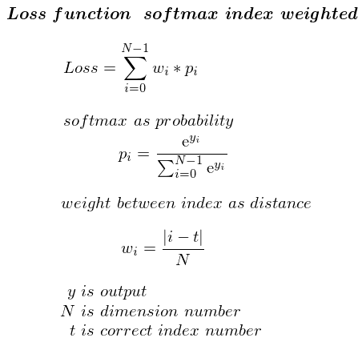
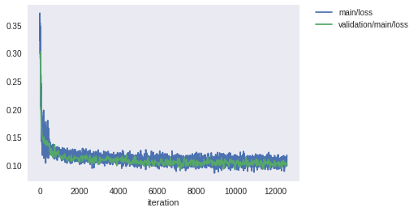
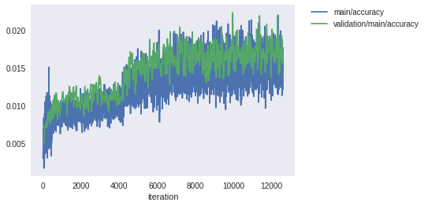
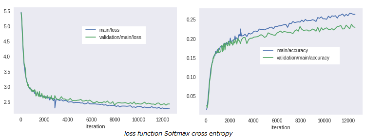

# 損失関数 Softmax Index Weighted

## 概要  

Chainerを使った自作の損失関数の実装。  
損失関数としては失敗作。  

[github repository](https://github.com/shun60s/softmax-index-weighted/)  
  
## 損失関数 Softmax Index Weighted   

### 定義  
  

### 式の意味  

音の波形を、量子化したone hotを入力して予測するとき、
損失関数 Softmax Cross Entropyでは、正解の１要素しか評価されない。 
音としてはできるだけ近い振幅値(indexが近い)に予想されるように、
振幅が近いほど損失値が小さくなるような評価式を考案してみた。  

## 実験  

WaveNet[Chainer-Examples-WaveNet](https://github.com/chainer/chainer/tree/master/examples/wavenet)を使った。　これに損失関数を追加し、変更を加えた。データは、非常に少ないが、お試しとして、wav of Pannouの中の140個（約130秒分）を使った。  
下図が損失と正解率の結果である。　４ iteration毎に描いていて、値が大きくばらついているため、波形がギザギサになっている。  

  
  

下図は比較のため、同じモデル構成と同じデータを使って損失関数にSoftmax Cross Entropyの場合の結果である。  
  

損失関数としてSoftmax Index Weightedを使った場合は正解率が全然向上していない。  
この理由は、Softmax Index Weightedでは、局所的に損失がボトムになるところ（局所最適）がいたるところにあって、ターゲットに落ち込まないためと考えられる。  

## 参考にしたもの  

- [chainer-colab-notebook, Synthesize Human Speech with WaveNet](https://chainer-colab-notebook.readthedocs.io/ja/latest/notebook/official_example/wavenet.html)
- [chainer-examples-wavnet](https://github.com/chainer/chainer/tree/master/examples/wavenet)
- [wav of Pannous, Description](https://github.com/AKBoles/Deep-Learning-Speech-Recognition/blob/master/Pannous-Walkthrough.md)
- [receptive field width, calculation method, by musyoku](https://github.com/musyoku/wavenet/blob/master/train_audio/train.py)

## ライセンス  

Chainerに関係するライセンスについては, docsの中のLICENSE-chainer.txtを見てください。  
  
  

